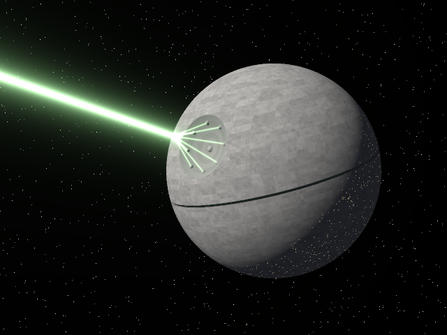

# Death Star on a PDP-10



A ray tracer written in MACRO-10 assembly for the DEC PDP-10's KA10 processor. It draws the Death Star firing its superlaser. The program runs under TOPS-10 6.03 on simh's KA10 simulator. The source goes in on (simulated) paper tape, and MACRO-10 and LINK-10 assemble and load it on the PDP-10 itself. The program prints a preview on the console and punches the full picture onto paper tape as a 640×480 colour PPM file. The picture above is that tape, converted to PNG.

## Run it

```sh
./run.sh
```

You need git, make, a C compiler, curl, unzip and python3. The first time, the script builds simh's `pdp10-ka` at a pinned commit and downloads [Richard Cornwell's TOPS-10 6.03 disk packs](https://sky-visions.com/dec/tops10.shtml) for the KA10 (a 55 MB zip, 320 MB unpacked). Everything goes in `build/`. After that, each run boots TOPS-10 from a fresh copy of the packs and takes about a minute and a half. The console session scrolls past as it goes. You end up with `build/death-star.png` and `build/transcript.txt`; [`transcript.txt`](transcript.txt) here is one such session.

These are the commands the script types at the console:

```
DATE: 05-25-78          Star Wars' first birthday (it turned down 25 May 1977 itself)
.login 1,2              the operator's account: only a privileged job can turn spooling off
.set spool none         so the program gets the real paper tape punch, not a spool file
.copy dstar.mac=ptr:    read the source off the paper tape reader
.execute dstar.mac      assemble it with MACRO-10, load it with LINK-10 and start it
```

## The preview

This is what DSTAR types on the console before it starts punching:

```
DSTAR - the Death Star, ray traced on a KA10

                                            .
                        .                      .                  .
                                                     .

.            .                                                         .
 .       .                      .
.....                                        .
::........             .   .              ##********+++++=
=---:::........  .                    #***##*******+*++*++++==
@@#*+=---::::.......                ***#***#*#**********+++=+==--
*#@@@@@@#+==--::::.......        ###****##*****+*+******++======--:
---==+*#@@@@@%*+=--::::......   #####***#*#********+++++++++=+===--:.   . .
..:::::--==+*%@@@@@#+==--:::..###*#+++********+*++**++++=++======--:..
.........::::---=+*%@@@@%*+=-###++@+++++#******+***+++++++=====----::*. .   .
      .........::::---=+*%@@@@@#++*++************+*+**+++++=====---::...
       .     .........::::--%@@@*****************+++++++++====-----:...*.
               .    ........##****##******++**+++++++++======-=---::....
                         . #*****@***#****+*+++++++++======------::... ..    .
                        .  ********-*+*+*++++++++=+++======----::. ......
                         . *+****#****++++++++*+=++=======--.--::...*....
       .        .           ++++**+*++**+*++++++=====. =-=--::::.........
                            ++*+++***++**+++..=========-----:::.......... .
                             ++++++++++++++++++======-----:::...........
                              ++++++++++++=+=====-=-----::::...........
  .                            =+++++===++====-=------:::.............      .
                                ===========---------::::............          .
               .                 .=========------::::.*............         .
                    .        .     .---------::::...............     .
                                      ..::::.................
                                     .      ............    .        .

              .                                                    .
                                .
                 .                  .                       .
.                                      .                       .      .
   .                            .

Punching a 640x480 PPM image, one dot every 16 rows:
..............................

Done in 57 seconds of CPU time.
```

The 57 seconds are how long simh took on a modern computer. A real KA10 would have needed about 2½ hours of CPU time, and a little over 5 hours in all because of the slow paper tape punch; see [On a real KA10](#on-a-real-ka10).

## How it works

**The scene.** In the Death Star's own coordinates it is a sphere of radius 1 with the north pole up. The superlaser dish is a spherical bite out of the northern hemisphere, with a small emitter sphere at the bottom and eight tributary lenses round it. The equatorial trench is a band around the equator, cut down to a slightly smaller sphere. So the solid is (hull − dish) − (trench band − floor sphere), plus the small spheres. The camera, the dish and the sun are all set up from angles and distances on the "The scene" page of [`dstar.mac`](dstar.mac).

**Finding the hit.** `TRACE` works out every place the ray crosses one of the surfaces: both crossings of the hull, the dish sphere and the floor sphere, and the two planes of the trench walls. It checks each one that is nearer than the best so far to see whether the point is really on the solid: inside the hull, outside the dish, and not in the trench unless it is down on the floor. The nearest point that passes is the hit. The emitter and the lenses are only tried if the ray goes through the dish sphere.

**Shading.** A second ray goes from the hit towards the sun for shadows. Then there is Lambert shading with a little blue ambient light. The hull is covered in panels of three sizes, each lightened or darkened by a hash of which grid cell it is in. The dish has rings. There are city lights scattered over the night side, and the dish picks up green light from the beams.

**The beams.** Each beam is a line segment: the main beam, its wider halo, and one from each lens to the focal point in front of the dish. For every camera ray, `GLOW` finds the closest the ray comes to each segment, d, and adds a glow of w/(1+d²/σ²)², unless the Death Star is in the way. The glow is green and goes white where it is brightest.

**The picture.** Each pixel is the average of 2×2 samples. Stars show through wherever a sample missed, and a square root does for gamma correction. Every byte of the PPM file goes to the punch in image mode, one byte per 36-bit word, and TOPS-10 adds blank leader and trailer. [`untape.py`](untape.py) finds the header on the tape and writes the PNG.

### Doing it on a KA10

The KA10 has single precision floating point with a 27-bit fraction, and the program uses only `FADR`, `FSBR`, `FMPR`, `FDVR` and `FSC` from it. The later processors' `FIX`, `FLTR` and `DMOVE` instructions aren't there, so:

- **Integer to float** is `FSC AC,233`. To the floating point hardware a small integer looks like an unnormalised float with a zero exponent. `FSC` adds 233 octal to the exponent (the bias of 200 plus 27 for the fraction bits) and normalises it, which leaves the float with the same value. `FSC AC,232` does that and halves it too.
- **Float to integer** is the old three-instruction trick `MULI AC,400` / `TSC AC,AC` / `ASH AC+1,-243(AC)`. It splits off the exponent, fixes it up for negative numbers and shifts the fraction into place. The result is the floor, which is just what the texture grid needs.
- **Square roots** start from a guess made by halving the exponent, followed by five rounds of Newton's method.
- **Sines** (only used while setting up the scene) come from a Taylor series in nested form, after bringing the angle into ±90°.
- **Random numbers** for the panels, city lights and stars come from an integer hash of the grid cell. `IMUL` keeps the low 35 bits of the product, so the Python model below can do exactly the same sums.

Floats on the PDP-10 compare like integers, so `CAMG` and `JUMPL` work on them directly, and `MOVN` negates them.

MACRO-10's numbers are octal unless they are written `^D640`, and only the first six characters of a symbol count.

## On a real KA10

This estimate comes from running DSTAR on a copy of simh patched to count every instruction the program executes. The patch also counted the things that change an instruction's time: indexing, operands in fast registers, and the exponent difference, normalising shifts and rounding of floating adds. The counts were then priced with the instruction times in DEC's May 1968 *PDP-10 System Reference Manual*, for user mode with 1.0 µs MA10 core memory.

- **The count.** DSTAR executes 1.79 billion instructions. MOVE is the commonest (22%), then FMPR (17%) and FADR (13%).
- **Computing.** At the manual's times that is about 2.4 hours of CPU time, 4.8 µs per instruction on average. Floating point is a third of the instructions but two thirds of the time. FMPR alone, at over 10 µs each, takes 55 minutes.
- **Punching.** The paper tape punch does 50 characters a second, so the 921,871 bytes on the tape take 5.1 hours, and about 2.3 km of tape. The program computes a byte in 9 ms on average but the punch needs 20 ms, so it would spend most of its time waiting for the punch: a little over five hours in all.
- **Magtape instead.** On a magtape drive such as the TU20, at roughly 6,000 words a second, the image takes only a few minutes of tape time. The job would then be done in about 2½ hours.
- **The rest of the session.** Reading the source from paper tape at 300 characters a second takes about 2 minutes. MACRO-10 executes 149 million instructions to assemble it, roughly 6 to 9 minutes. The preview's 2,423 characters take 4 minutes on a Model 35 Teletype at 10 characters a second.

These are estimates. The manual's times are ±5%, the multiply times are averages, and the monitor's own work, like the punch's 900,000 interrupts, is left out. Slower 1.65 µs MB10 core memory, or other users on the time-sharing system, would stretch it further.

## Checking it

[`reference.py`](reference.py) is the same program in Python: the same algorithm, the same constants and the same hash, in double precision. It is much quicker for trying out changes to the scene before putting them into the assembly. The KA10's preview matches it character for character. Out of the 307,200 pixels in the picture, 18 differ, by at most 2 in 255.

```sh
python3 reference.py preview
python3 reference.py image 640 480 2 reference.png    # about half a minute
```

## Files

| File | What it is |
| --- | --- |
| `dstar.mac` | The ray tracer, in MACRO-10 |
| `run.sh` | Builds simh, fetches TOPS-10, and runs the whole session |
| `untape.py` | Turns the punched paper tape into a PNG |
| `reference.py` | The Python model of `dstar.mac` |
| `death-star.png` | The picture the KA10 punched |
| `transcript.txt` | The console session that punched it |

## Thanks

To the [Open SIMH](https://github.com/open-simh/simh) project, and to Richard Cornwell, who wrote its KA10 simulator and built the TOPS-10 6.03 disk packs from DEC's distribution tapes.
