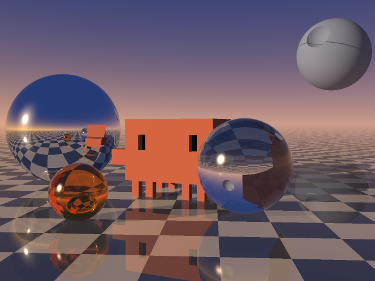

# Glass and mirrors on a PDP-10



A recursive ray tracer written in MACRO-10 assembly for the DEC PDP-10's KA10 processor, in the style of Turner Whitted's 1979 paper, which introduced it. Clawd, the Claude Code mascot, stands on a polished checkerboard at sunset. Around it are a mirror ball, a glass ball and an amber marble, and the Death Star from [pdp10-death-star](../pdp10-death-star) is rising behind. Mirrors reflect, glass both reflects and refracts, the floor reflects a little, and everything casts shadows.

Like the Death Star, it runs under TOPS-10 6.03 on simh's KA10 simulator. The source goes in on (simulated) paper tape, MACRO-10 and LINK-10 assemble and load it on the PDP-10, and the picture comes out on the paper tape punch as a 640×480 colour PPM file. The picture above is that tape, converted to PNG.

## Run it

```sh
./run.sh
```

You need git, make, a C compiler, curl, unzip and python3. The first time, the script builds simh's `pdp10-ka` at a pinned commit and downloads [Richard Cornwell's TOPS-10 6.03 disk packs](https://sky-visions.com/dec/tops10.shtml) for the KA10 (a 55 MB zip, 320 MB unpacked). Everything goes in `build/`. After that, each run boots TOPS-10 from a fresh copy of the packs and takes about two minutes. You end up with `build/glass-and-mirrors.png` and `build/transcript.txt`; [`transcript.txt`](transcript.txt) here is one such session.

## What it types

GLASS draws Clawd on the console before it starts, from the same table of boxes it builds the 3D Clawd from. It finishes by counting the rays:

```
GLASS - Clawd among glass and mirrors, ray traced on a KA10

      ########################
      ########################
      ####  ############  ####
      ####  ############  ####
  ################################
  ################################
      ########################
      ########################
        ##  ##        ##  ##
        ##  ##        ##  ##

Punching a 640x480 PPM image, one dot every 16 rows:
..............................

Camera rays       1228800
Reflected rays    1612765
Refracted rays     642507
Shadow rays        923779
Deepest level           6

Done in 91 seconds of CPU time.
```

The 91 seconds are how long simh took on a modern computer; a real KA10 would have taken hours (see below).

## How it works

**The scene.** The floor is the plane y = 0, with squares 50 cm across. There are three spheres: glass, mirror and amber glass. Clawd is 16 boxes. The sky is a sunset gradient with a glow round the sun. The Death Star is a sphere with a smaller sphere scooped out for the dish and a darker band for the trench. It is so far away that every ray might as well start at the origin when it looks for it. All of it is set up on the "The scene" page of [`glass.mac`](glass.mac).

**Clawd** comes from the Claude Code logo, which is drawn with quadrant block characters:

```
 ▐▛███▜▌
▝▜█████▛▘
  ▘▘ ▝▝
```

Each character is 2×2 pixels. A character cell is twice as tall as it is wide, so the pixels are too: 10 cm wide and 20 cm tall here. Each run of pixels in a row of the logo becomes a box 80 cm deep, except the legs, which are one pixel deep and repeated at the back. The eyes are set one pixel in. `TRACE` turns each ray into Clawd's own coordinates, since Clawd is turned 18° towards the glass ball. There it tests a box round all of Clawd first, then each of the 16 boxes with the slab method.

**Recursion.** `SHADE` follows a ray, and for mirrors, glass and the floor it follows the rays that one makes. The PDP-10's `PUSHJ` saves only the return address, so every level of recursion has a frame of 36 words for its ray, hit, normal, directions, weights and colour. Accumulator F points to the current one. `RECUR` fills in the next frame, adds its length to F, calls `SHADE` and subtracts it again. A ray stops when it is 6 levels deep or counts for less than 1% of its pixel.

**Materials.**
- **Glass** splits each ray into a reflected and a refracted one, weighted by Schlick's approximation to the Fresnel equations. The code handles total internal reflection, but it never happens: a ray that gets into a glass sphere always gets out again.
- **Mirrors** reflect 90%, with a slight blue tint.
- **The floor** reflects 22% of the light and fades into the horizon with distance.
- **Clawd and the floor** get sunlight if a shadow ray to the sun gets through, plus a little sky light and a highlight. The glass ball lets through 72% of the sunlight and the amber marble 45%, so their shadows are lighter, though there are no caustics.

### A KA10 surprise

The sun's glints are powers like (R·S)²⁵⁶, done by squaring 8 times. On a modern machine a number that gets too small becomes 0. On the KA10, floating underflow sets a flag and wraps the exponent round, so 10⁻⁴⁰ comes back as about 10³⁷. The first test picture had speckles of pure white and black over every mirror and glass surface that faced the sun. Now `SQUARN` does the squaring and gives up at 10⁻¹⁵.

## On a real KA10

This estimate comes from running GLASS on a copy of simh patched to count every instruction the program executes, together with the things that change how long each one takes. The counts were then priced with the instruction times in DEC's May 1968 *PDP-10 System Reference Manual*, for user mode with 1.0 µs MA10 core memory.

- **The count.** GLASS executes 2.79 billion instructions, half as many again as the Death Star's 1.79 billion. 30% of them are floating point.
- **Computing.** That is about 3¼ hours of CPU time, 4.2 µs per instruction on average. Floating point takes 58% of the time, and FMPR alone takes an hour.
- **Punching.** The paper tape punch does 50 characters a second. The 921,871 bytes on the tape take 5.1 hours, and about 2.3 km of tape, so the punch still sets the pace: a little over five hours in all.
- **Magtape instead.** The picture would go to tape in a few minutes, and the job would take about 3¼ hours.

These are estimates. The manual's times are ±5%, the multiply times are averages, and the monitor's own work is left out. Slower 1.65 µs MB10 core memory, or other users on the time-sharing system, would stretch it further. For comparison, Whitted's best-known 1979 picture took 74 minutes at 512×512 on a VAX-11/780, a faster machine.

## Checking it

[`reference.py`](reference.py) is the same program in Python, with the same algorithm and constants, in double precision. It is much quicker for trying out changes to the scene before putting them into the assembly. It also counts the rays: 1,612,685 reflected, 642,524 refracted and 923,834 shadow rays, against the KA10's 1,612,765, 642,507 and 923,779. On 463 of the 307,200 pixels the picture differs from the KA10's, and on 25 by more than 2 in 255, all in places where six bounces magnify the difference between 27-bit and 53-bit fractions. Those places are the tiny far-away squares in the mirror ball and the inside of the amber marble.

```sh
python3 reference.py banner
python3 reference.py image 640 480 2 reference.png    # about half a minute
```

## Files

| File | What it is |
| --- | --- |
| `glass.mac` | The ray tracer, in MACRO-10 |
| `run.sh` | Builds simh, fetches TOPS-10, and runs the whole session |
| `untape.py` | Turns the punched paper tape into a PNG |
| `reference.py` | The Python model of `glass.mac` |
| `glass-and-mirrors.png` | The picture the KA10 punched |
| `transcript.txt` | The console session that punched it |
