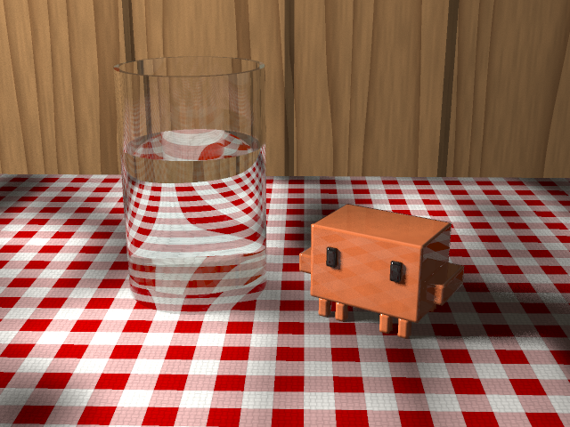

# A still life on a PDP-10



A recursive ray tracer written in MACRO-10 assembly for the DEC PDP-10's KA10 processor. It draws a still life: a little glazed ceramic Clawd, the Claude Code mascot, on a gingham tablecloth next to a glass of water, in front of oak panelling, lit by a window. There are no flat colours. The cloth is woven and wrinkled, the oak has grain, the glaze is a little uneven, and the water bends the checks of the tablecloth.

Like [pdp10-death-star](../pdp10-death-star), it runs under TOPS-10 6.03 on simh's KA10 simulator. The source goes in on (simulated) paper tape, MACRO-10 and LINK-10 assemble and load it on the PDP-10, and the picture comes out on the paper tape punch as a 640×480 colour PPM file. The picture above is that tape, converted to PNG.

## Run it

```sh
./run.sh
```

You need git, make, a C compiler, curl, unzip and python3. The first time, the script builds simh's `pdp10-ka` at a pinned commit and downloads [Richard Cornwell's TOPS-10 6.03 disk packs](https://sky-visions.com/dec/tops10.shtml) for the KA10 (a 55 MB zip, 320 MB unpacked). Everything goes in `build/`. After that, each run boots TOPS-10 from a fresh copy of the packs and takes about five minutes. You end up with `build/still-life.png` and `build/transcript.txt`; [`transcript.txt`](transcript.txt) here is one such session.

## What it types

STILL draws Clawd on the console before it starts, from the same table of boxes it builds the 3D Clawd from. It finishes by counting the rays:

```
STILL - Clawd and a glass of water, ray traced on a KA10

      ########################
      ########################
      ####  ############  ####
      ####  ############  ####
  ################################
  ################################
      ########################
      ########################
        ##  ##        ##  ##
        ##  ##        ##  ##

Punching a 640x480 PPM image, one dot every 16 rows:
..............................

Camera rays       1228800
Reflected rays    1695408
Refracted rays    1511962
Shadow rays       7035415
Deepest level          10

Done in 254 seconds of CPU time.
```

The 254 seconds are how long simh took on a modern computer. A real KA10 would have needed all night (see below).

## How it works

**The scene.** Lengths are in centimetres. The room is a box, and the table top is its floor. The glass is two upright cylinders, for the outside and the inside, and four flat rings and discs: its bottom, the floor of its inside, its rim and the top of the water. Clawd is 13 boxes. All of it is set up on the "The scene" page of [`still.mac`](still.mac).

**Clawd** comes from the Claude Code logo, which is drawn with quadrant block characters:

```
 ▐▛███▜▌
▝▜█████▛▘
  ▘▘ ▝▝
```

Each character is 2×2 pixels. A character cell is twice as tall as it is wide, so the pixels are too: 4.2 mm wide and 8.4 mm tall here, which makes Clawd about 7 cm across. Clawd is built from a box for the body, one for each arm, four legs at the front and four at the back, and two eyes standing a little proud of the face. The edges look rounded because the normal is taken from the nearest point of the box shrunk by 1.2 mm, so it tips over near the edges.

**Glass and water.** Every surface of the glass knows what is on each side of it: air, glass or water. A ray crossing it goes from one refractive index into the other (1.0, 1.5 or 1.33), or is reflected back, weighted by Schlick's approximation to the Fresnel equations. Going straight through the glass of water takes four surfaces, and each one also sends back a reflection. So rays stop at 10 levels of recursion, or when they count for less than 1% of their pixel. Light is absorbed along the way, a little more in the red than the other colours, so thick glass looks slightly green and water very slightly blue. Unlike in a glass sphere, total internal reflection really happens here: it is about one reflection in twenty.

**The window** is an area light. From every point that isn't glass, four shadow rays go to random points in the four quarters of the window, so shadows are soft at the edges. Light going through the glass is cut to 62%, without caustics. A 35-bit linear congruential generator makes the random numbers. It starts afresh for every sample from a hash of the pixel, so the PDP-10 and the Python model below use exactly the same ones.

**Textures** are all made from Part I's integer hash, as value noise: random numbers at whole-number points, blended with a smooth step.
- **The gingham:** red stripes cross over white and are deeper red where two meet. Its threads go over and under each other, so each one is shaded across its width and varies a little from its neighbours.
- **The wrinkles:** the slope of two octaves of noise tips the cloth's normal (bump mapping).
- **The oak** is flat-sawn boards. The growth rings are arcs round a line just under the surface, wobbled by noise, with a dark groove between boards and a rail above them. Wallpaper goes above that, out of the picture.
- **Clawd's glaze** varies a little in tone, and reflects 5% of the light head on and more at glancing angles.

**Recursion.** The PDP-10's `PUSHJ` saves only the return address, so every level of `SHADE` has its own frame of 37 words for its ray, hit, normals, directions, media and colour. Accumulator F points to the current one. `RECUR` fills in the next frame, adds its length to F, calls `SHADE` and subtracts it again.

### KA10 lessons

- **Underflow wraps.** On the KA10, floating underflow doesn't give 0: it wraps the exponent round, so 10⁻⁴⁰ comes back as about 10³⁷. Schlick's x⁵ is skipped when x is below 10⁻⁶ for that reason.
- **Opcodes aren't free names.** The table of refractive indices was first called `IOR`, which is also the inclusive-or instruction that the square root routine uses. It is called `RIDX` now.
- **Ties need a rule.** The glass stands on the cloth, so its bottom and the table top are the same plane. Rays inside the base hit both at exactly the same distance. The table is tested first and wins, which puts the cloth in contact with the glass, as it should be.

## On a real KA10

This estimate comes from running STILL on a copy of simh patched to count every instruction the program executes, together with the things that change how long each one takes. The counts were then priced with the instruction times in DEC's May 1968 *PDP-10 System Reference Manual*, for user mode with 1.0 µs MA10 core memory.

- **The count.** STILL executes 8.3 billion instructions, a quarter of them floating point. That is almost five times as many as the Death Star.
- **Computing.** That is about 9½ hours of CPU time, 4.2 µs per instruction on average. FMPR alone takes over two hours, and FDVR, much of it in square roots, another hour.
- **Punching.** The paper tape punch does 50 characters a second, so the 921,871 bytes take 5.1 hours. This time the computing is the slower part, and the punch keeps up with it, so the whole job takes about 9½ hours: overnight.

These are estimates. The manual's times are ±5%, the multiply times are averages, and the monitor's own work is left out. Slower 1.65 µs MB10 core memory, or other users on the time-sharing system, would stretch it further.

## Checking it

[`reference.py`](reference.py) is the same program in Python, with the same algorithm, constants, hash and random numbers, in double precision. It is much quicker for trying out changes to the scene before putting them into the assembly. It counts the rays too, and they agree with the KA10's to within a few: 1,695,410 reflected, 1,511,963 refracted and 7,035,419 shadow rays, against 1,695,408, 1,511,962 and 7,035,415. Of the 307,200 pixels, 114 differ from the KA10's, and 10 by more than 2 in 255, where the KA10's 27-bit fractions and Python's 53-bit ones round a hair differently.

```sh
python3 reference.py banner
python3 reference.py image 640 480 2 reference.png    # about two minutes
```

## Files

| File | What it is |
| --- | --- |
| `still.mac` | The ray tracer, in MACRO-10 |
| `run.sh` | Builds simh, fetches TOPS-10, and runs the whole session |
| `untape.py` | Turns the punched paper tape into a PNG |
| `reference.py` | The Python model of `still.mac` |
| `still-life.png` | The picture the KA10 punched |
| `transcript.txt` | The console session that punched it |
